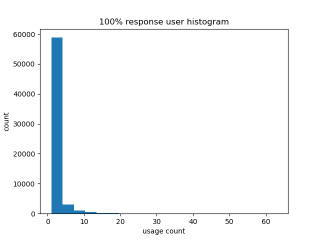
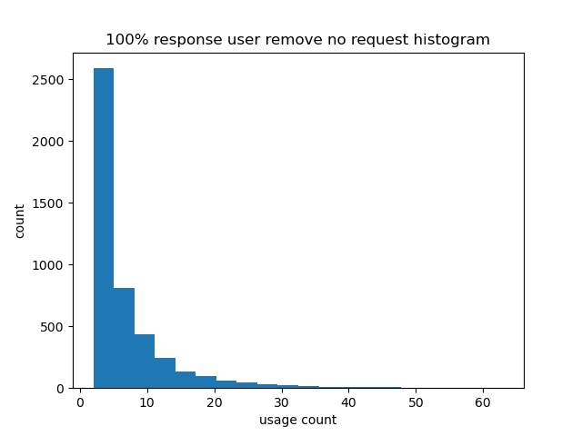
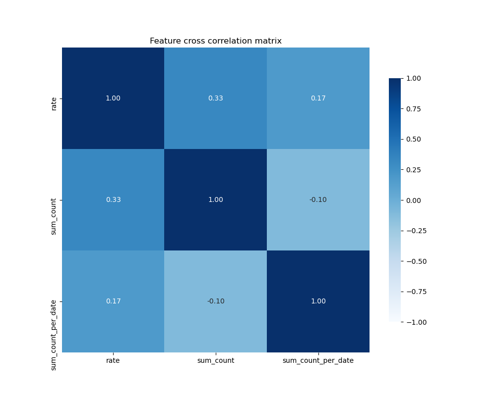
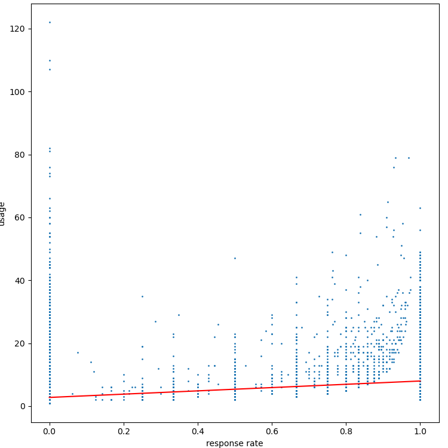
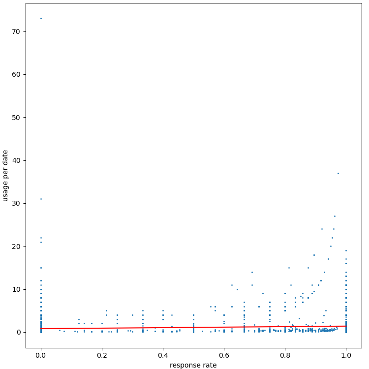

더치페이 요청에 대한 응답률이 높을수록 더치페이 서비스를 더 많이 사용한다. 가설 검증
==

1. 응답률에 대한 정의    
    - 응답    
        응답은 dutchpay_claim_detail에서 status가 CLAIM 상태가 아닌 경우 응답했다 하겠습니다.    
        SEND이나 CHECK의 경우 send_amount와 claim_amount의 값이 채워지기 때문입니다.    
    - 응답률    
        dutchpay_claim_detail에서 recv_user_id에 적힌 user의 각각의 전체 수가 요청의 횟수이고, 그에 해당하는 status가 CLAIM의 상태가 아닌 수가 응답횟수이기 때문에 이 비율을 응답률이라고 하겠습니다.  

2. 서비스 사용량에 대한 정의    
    서비스를 사용한다는 것은, 요청을 시도하거나 요청에 반응한 수라고 할 수 있습니다. 따라서 반응수 + 요청수를 한 값으로 정의 합니다.

3. 데이터 처리    
    데이터의 처리 없이 바로 cross correlation을 계산하면 증명하려고 하는 가설의 반대의 값이 나옵니다.    
    이 원인은 응답률이 1.0인 인원 중 사용 횟수가 작은 데이터가 다수 있기 때문입니다.    
        
    따라서 이러한 노이즈를 처리해야 합니다.
    사용자가 단순 1일 이상 사용한 경우를 보면 총 123924개의 user 중 22643이 남습니다. 이럴 경우 총사용량(sum_count)와의 상관계수는 0.3 정도의 양의 상관관계를 가지게 되지만 데이터가 너무 많이 제외되는 경향이 있습니다.    
    따라서 해당 방법보다 완화된, 요청을 한번도 하지 않은 user를 noise로 정의하겠습니다. 이 경우 총 123924개 중 53558개의 데이터가 살아남습니다.   
        
    대부분의 매우 작은 사용량을 보이던 user들이 없어졌습니다.    
    기존에 요청을 보내지 않는 수동적인 사용자들은 사용 횟수도 낮을 뿐더러, 서비스를 이용하지는 않지만, 더치페이라는 특성상 응답을 수행했던 사람이 noise로서 제외되었습니다.
    추가로 반응 횟수를 계산하기 전에 자기자신이 자신에게 보낸 response는 제외하였습니다.

4. 검증    
    noise로 작용할 수 있는 데이터를 제외한 후 feature들 간의 관계가 있는지에 대한 T test를 통해 각 변수들 간의 상관이 있는지를 확인하겠습니다.
    각 가설은 다음과 같습니다.    
    - H0(귀무가설) : rate와 sum_count 또는 sum_count_per_date는 상관관계가 없다.    
    - H1(대립가설) : rate와 sum_count 또는 sum_count_per_date는 상관관계가 있다.    

    scipy의 pearsonr을 통해 실험을 진행한 결과, rate와 sum_count, sum_count_per_date는 p-value가 0이 나와 귀무가설을 기각할 수 있었습니다. 따라서 둘 사이에는 상관관계가 있습니다.    

    이제 경양성을 보기위하여 상관계수를 통한 검증을 수행하겠습니다.    
    상관계수는 각 feature간의 상관관계에 대한 지표로서 간편하게 두 데이터간의 경양성을 확인하기 편리합니다.    
        
    여기서 보려 하는 것은 응담률(rate)와 서비스 사용의 상관관계입니다.    
    sum_count는 서비스 사용회수이며, sum_count_per_date는 일일 사용량에 대한 수입니다.    
    두 feature와 rate은 약하지만, 양의 상관관계를 가집니다. 이것이 의미하는 것은 rate이 증가할 수록 sum_count, sum_count_per_date도 같이 증가하는 성향이 있다는 것입니다. 따라서 더치페이 요청에 대한 응답률이 높을수록 더치페이 서비스를 더 많이 사용하는 경향이 있다고 볼 수 있습니다.    
    이는 단순 경향성을 보기 때문에 회기 분석을 더해서 실제 그런지 시각적으로 확인하도록 하겠습니다.    
        
    위에 그래프는 usage(sum_count)와 response rate(rate)를 scatter plot하고, 그 위에 linear regression 결과를 line으로 그려넣은 것입니다.    
    response rate이 증가할 수록 사용량이 늘어나는 것을 확실히 볼 수 있습니다.    
        
    마찬가지로 일별 사용량도 같이 증가하는 것을 볼 수 있습니다.    
    line그래프는 미약하게 우상향을 하고 있습니다.    

    먼저 T 검증을 통해 각 feature의 관계를 검증하고, 상관계수 분석과 회기분석을 사용한 이유는, 가설이 두 변수(응답률, 사용량)에 대한 성향적 분석을 통해 두 변수가 관계를 가지며, 그것이 등비라는 것을 보여야하기 때문에 적합하다 생각하여 수행 했으며, 시각적으로 확인을 위해 회기분석을 사용했습니다.