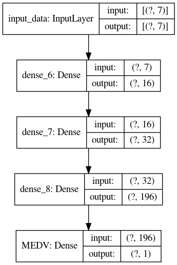

보스턴 지역의 지역별 집값 예측   
==
1. EDA
    먼저 계산해야 할 값인 MEDV와 각 feature간의 상관관계를 알아보아야 합니다.        
        
    위의 그림은 각 feature간의 상관계수 값입니다.    
    각각의 연관성이 강한 feature끼리 묶어 관계를 표현해 봅니다.    
    |feature                                  |상관관계|    
    |-----------------------------------------|------|    
    |CRIM, RAD, TAX, NOX, INDUS, AGE, LSTAT, B|--    |    
    |ZN, DIS                                  |+     |    
    |CHAS                                     |+     |    
    |RM                                       |++    |    
    |PTRATIO                                  |--    |    
    
    
    서로 연관성이 비교적 높은 feature들을 묶어서 위와 같은 표로 정리했습니다.    
    
    먼저 양의방향, 음의방향으로 상관관계가 높은 2개의 feature를 선정합니다. 여기서는 RM, LSTAT 입니다.    

    두번째로, 다른 것보다 MEDV와 연관관계가 높은 PTRATIO가 적합하다고 할 수 있습니다.    

    세번째로, CHAS의 경우 다른 feature와의 상관관계가 적으며, MEDV와 상관관계가 가장 큽니다. 따라서 feature에 적합하다고 볼 수 있습니다.    

    네번째로, ZN과 DIS 중 다른 feature와 상관관계가 더 적고, MEDV에 상관관계가 더 높은 ZN을 선정했습니다.    

    다섯번째로, TAX와 AGE는 나머지 서로 비슷한 상관관계를 가지지만, 먼저 선정 된 ZN과 PTRATIO과 상반된 상관관계를 가지므로 결과값의 세부 값들에 영향을 줄 것이라 생각되어 추가하였습니다.      

    최종 선정된 feature는 다음과 같습니다.
    ['RM', 'PTRATIO', 'CHAS', 'TAX', 'ZN', 'AGE', 'LSTAT']    

2. 데이터 전처리    
    데이터 구조가 단순하기 때문에 각각의 column의 max값을 이용한 normalization을 수행

3. 모델 선정    
    단순한 regression을 위하여, Dense들의 조합의 layer를 구성하였습니다.    
        
    모델의 구조는 실험적으로 좋은 결과가 나오는 구조를 찾아 결과를 도출하였습니다.    
    입력으로는 앞에서 지정한 7개의 데이터를 집어넣어 최종 output은 linear activation을 통한 1개의 MEDV 예측값입니다.    

4. 실험 과정
    실험은 전체 데이터 506개 중의 랜덤 선정을 통한 80%의 데이터를 train에 사용하고, 20%의 데이터를 test로 사용하였습니다.  
    최종적 output의 정규화에 사용하였던 max값을 곱하여 최종 예측값이 계산됩니다.    
    optimizer를 mse, mae, rmse를 사용하여 3개의 모델의 값의 결과를 평균내는 ensemble을 사용하여 모델 성능을 향상시켰습니다.    

5. 결과    
    결과를 도출하는데는 2가지 지표를 사용하였습니다.    
    - RMSE    
        Kaggle에서 Evaluation으로 사용한 지표로써, 지금 모델의 성능이 leader board상의 어느정도 위치인지 평가할 수 있습니다.    
    - R2 socre    
        결정계수로 regression 모델의 설명력을 평가하는 지표이기 때문에 확인을 위해 도입했습니다.    

    모델의 성능은 다음과 같습니다.
    - RMSE : 2.776
    - R2 score : 0.884    
    결과 상으로 kaggle의 leader board상의 4위에 해당하는 RMSE값이 나오며, R2값도 비교적 높게 얻을 수 있었습니다.